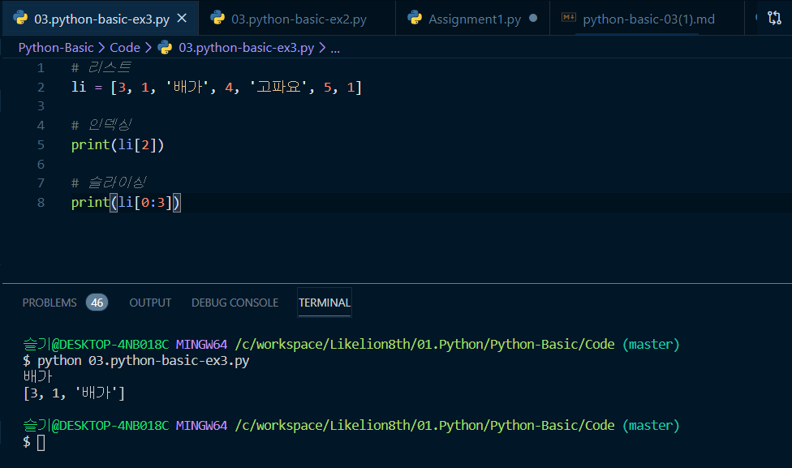
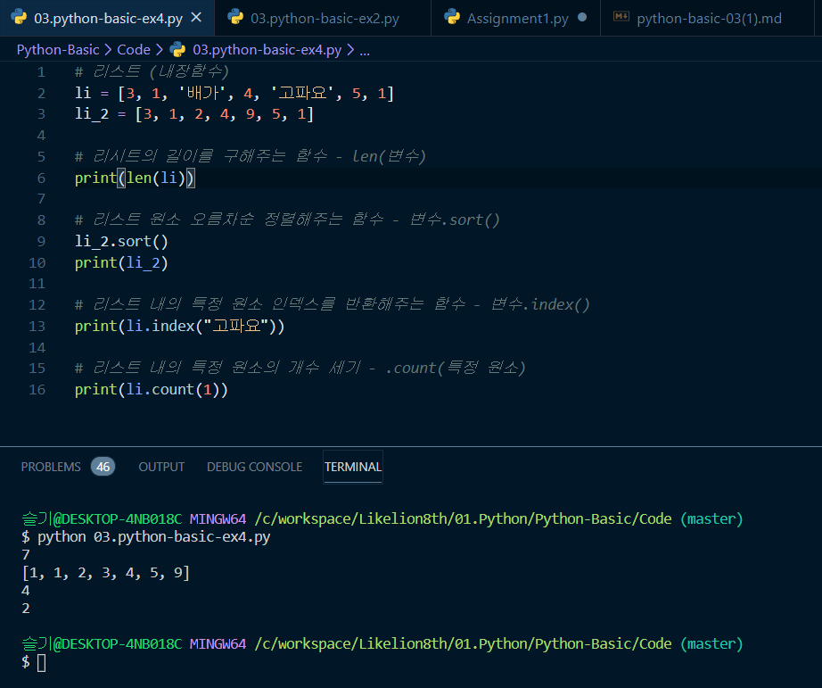

# [Python] BASIC 3. 자료형(2)

우리는 파이썬의 가장 기본적인 자료형인 숫자형과 문자형에 대해 알아보았습니다. 이어 우리가 자료를 효율적으로 관리하기 위해 필요한 자료형에 대해 알아보겠습니다. 이번에 소개할 자료형들을 잘 이해하기 위해서라면 왜 이런 자료형이 등장했고, 어떤 방법으로 데이터들을 관리할 수 있는지 정확하게 알고 넘어가는 것이 중요합니다.

## 리스트

 리스트는 **변할 수도 있는 데이터들을 나란히 묶어주는 자료형**입니다. 정리가 되어 있지않고 난잡하게 흩어져 있는 데이터들을 기준에 따라 묶어준다고 생각하면 쉽습니다. 그리고 그 데이터들은 변할 수 있죠. 

**나란히**라는 단어에서 문자열과 리스트는 비슷한 면이 있습니다. 문자들이 나란히 연결되어 있는 문자열처럼 데이터가 나란히 나열되어 있는 자료형을 리스트라고 부릅니다. 문자열과 흡사하기 때문에 덧셈, 곱셈, 인덱싱, 슬라이싱 모두 가능합니다.

리스트는 대괄호안에 데이터를 나열하는 형태로,  **['90', '86', '98']** 같은 형태로 작성합니다. 

- 리스트 사용법
    - 리스트의 덧셈 : [1,2,3] + [4,5,6] = **[1,2,3,4,5,6]**
    - 리스트의 곱셈 : [1,2,3] * 3 == **[1,2,3,1,2,3,1,2,3]**
    - 리스트의 인덱싱 : list가 [1,2,3]인 경우 ⇒  **list[0] == 1**
    - 리스트의 슬라이싱 : list가 [1,2,3]인 경우 ⇒  **list[0:2] == [1,2]**
    - 요소 변경 : list가 [1,2,3] 인 경우 list[0]=5 ⇒ **[5,2,3]**

실습을 할 파이썬 파일을 하나 만들고 직접 작성해 실행해봅시다.

인덱싱 : list의 2번째 인덱스인 문자열 '배가' 가 출력됩니다.

슬라이싱 : list의 0번째 ~ 2번째 요소까지 리스트 형태로 출력됩니다.

## 리스트의 내장함수

 파이썬에는 리스트를 보다 편리하게 가공하고 이용할 수 있게 제공해주는 내장함수가 존재합니다.. 가장 많이 쓰이는 내장함수들을 알아보겠습니다.

 **len(리스트)** : 리스트의 길이를 구하는 함수입니다.

- **리스트.sort()** : 리스트의 원소를 오름차순으로 정렬해주는 함수입니다.

    sort()는 정렬된 리스트를 반환하지 않고 리스트 자체를 정렬하기 때문에 None이 출력되는 것을 볼 수 있습니다. 정렬된 리스트를 출력하고 싶다면 sort 함수를 사용한 뒤 list를 출력 해봅시다.

 **리스트.index(특정원소)** : 리스트 내에서 특정 원소값의 인덱스를 반환하는 함수입니다.

 **리스트.count(특정원소)** : 리스트 내 특정 원소의 갯수를 반환하는 함수입니다.
